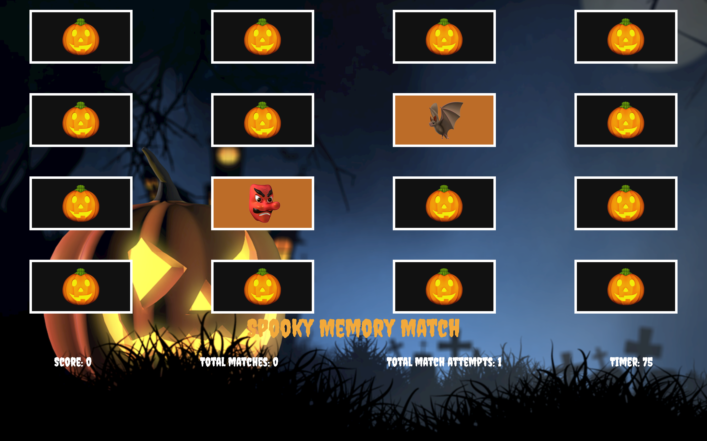
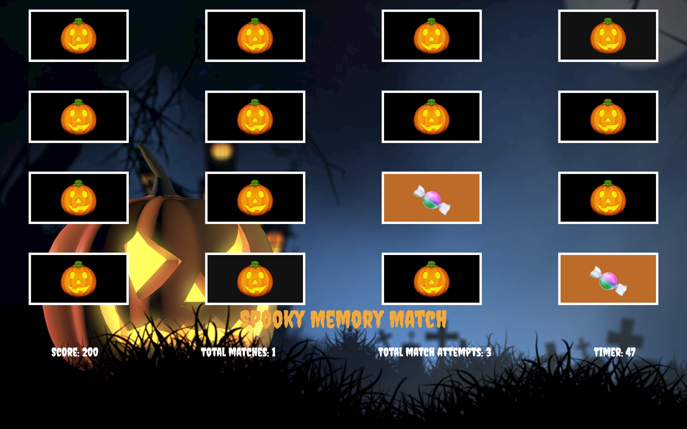

# Spooky Memory Match

# Link to my game:
https://nvandy23.github.io/P1-Memory-Matcher-game/

# Rules of the game 

Spooky Memory Match consists of 16 cards arranged in a 4x4 grid, each displaying the same Halloween-themed emoji. When the player clicks on a card, it will reveal a different Halloween-themed emoji. There are a total of 8 pairs of matching emojis, and the player's goal is to find all the matches to win.

The player will lose and trigger a game over if:

The player exceeds 25 attempts to find all the matches.
The 100-second timer runs out before the player completes all the matches.

The player will win if they can complete the tasks within these variables. Due to these challenges, the game is designed to provide a fast-paced, short, and engaging experience.

The cards will be shuffled with each reset, making the game replayable.

A player's score will also be displayed during the game. The player will earn 200 points for a correct match and will have 40 points deducted for each incorrect match. The results will be rendered based on the player's score, indicating how well they performed.

Here are some screenshots of the game in different states:

Start screen:

Incorrect screen:

Correct screen:

Game over:

Game won:

Please click the link above and try the game for yourself!

Technologies used: HTML5,CSS, and Javascript.
Game creator: Richard "Nick" Vanderipe.
Acknowledgements: Thanks to pixabay.com (credited in app.css) for allowing me to use high resolution backgrounds. This played a huge part in the styling of this game.
Future features: Streak bonuses, Time completion bonus, and accurate mobile app rendering.

