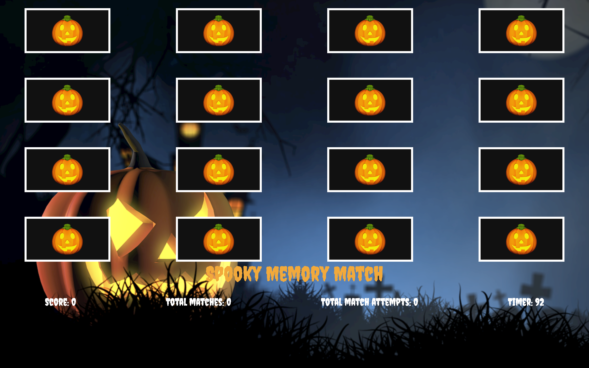

# Your choice of game
Memory Matcher 

## User stories
As a player, I would like to start the game when I'm ready. Not have it start right away.
As a player, I would like to win or lose the game, not win eventually.
As a player, I would like the game to have several variables to keep the game interesting, but not needlessly complicate the core gameplay. 
As a player, if I win or lose, I would like to see the display of my results and a screen showing me the option to reset and play again.

## A wireframe of your "main" game screen

## Psuedocode for the overall game play.

1. Initial 
• Declare global variables, select nodes and save in variables. Declare empty arrays for selected choices and choices won.

 2. Display game screen
 • Add event listener to start button to remove start screen
• Render the game screen. Set display or add class of game screen container to display all contents. 
 •Set conditons for timer to start if start button is clicked. 
• Shuffle all the cells on every reset of the game.

 3. Overall game play
 • Add event listeners for each cell within the container.
•Push cells that are clicked into the choices selected array.
 • If two choices are selected,reset the array to an empty one. 
 •Compare the values of the two cells selected, if their values match, push them into the choices won array, and add to score and total matches, if not, make sure they are cleared in the choices selected array and back into node list. Update negative points to score per attempt. Update the matches attempted class.
• Determine win conditions
• If win conditions are met, display end game scree with total points and reset button.Remove game container class. Add event listener to reset button.
• If lose conditions are met,repeat the same step as above.

4. End game
• If reset button is click, render the game screen once again for user. Reset timer,score and matches all back to beginning state.
